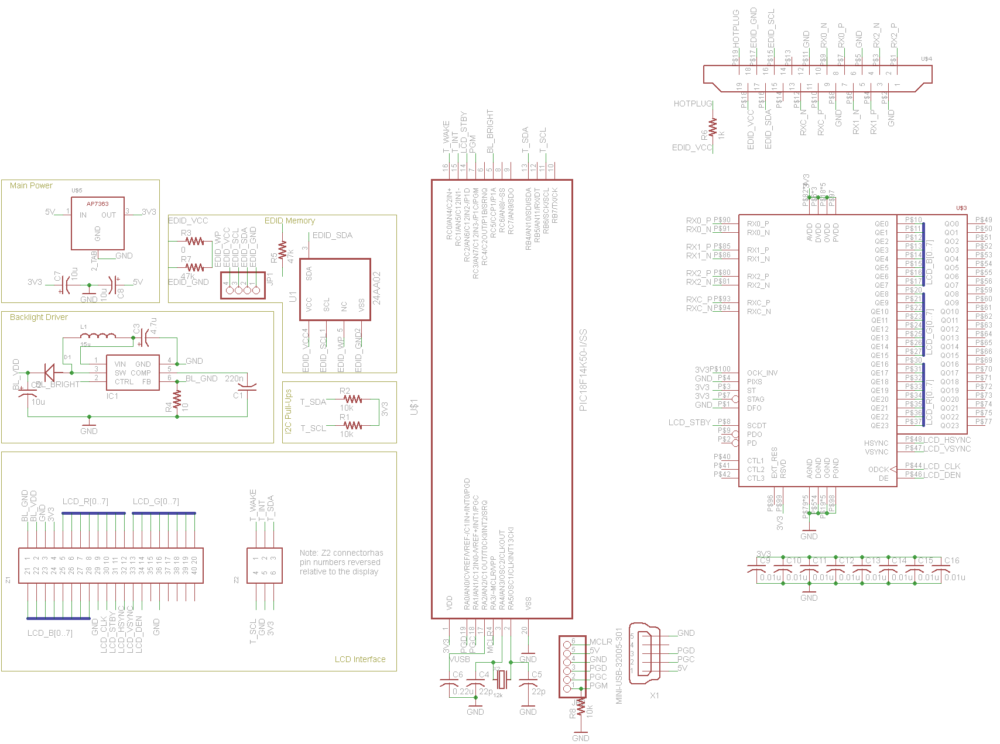

# 5-inch LCD / Multitouch Board
Drive an LCD with a multitouch panel using a PIC and custom PCB!

*The code and CAD files for this project are incomplete, as the
project is under active development. If you have any questions,
please do not hesitate to contact the author.* This project began
in 2013 and has slowly been developed to where it is today in the
free time of the developer as a means to learn more about hardware
design. As such, it is not recommended that this project be used
as a model for commercial work and that developers exercise a
measured amount of caution when using this project.

Assembling this project for yourself is no small task. The project
consists of a very wide range of components, ranging from ordering
custom circuit boards, ordering about $100 in parts, soldering all
of the surface mount components to the board, and then programming
the microcontroller and eeprom on the board.

Once everything is assembled and running, you should have a small
[800x480 LCD](http://www.newhavendisplay.com/specs/NHD-5.0-800480TF-ATXI-CTP.pdf) 
vailable via an HDMI or DVI port, and a 5-point touch surface with
which to interact with it.

This project makes use of a [TPS61165](http://www.ti.com/product/tps61165)
LED backlight driver. This is sufficient to drive the backlight
in the LCD panel, and supports dimming via a 1-wire interface or
through PWM.

Please note that this design does not support HDCP, as it uses a
DVI display chip, the [TFP401A](http://www.ti.com/product/tfp401a).
If youi would like to modify this design to support HDCP, you
could build it around the TFP501 instead.

## Latest Schematic

